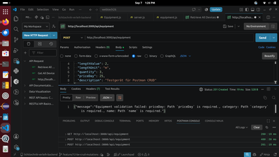
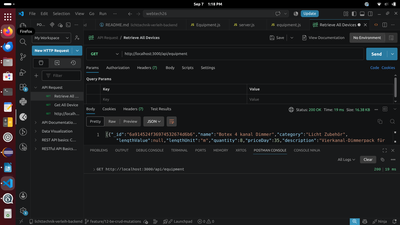
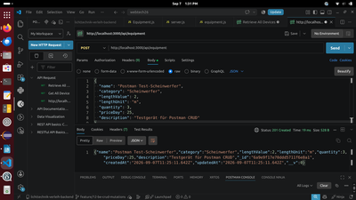
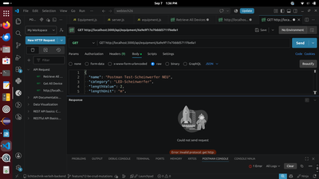
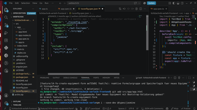
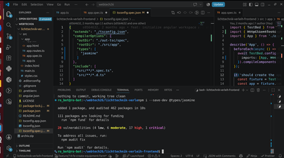

**# Lichttechnik-Verleih – Backend**

Das Backend des Projekts **\*\*Leons-Lichttechnik-Verleih\*\*** stellt die serverseitige REST-API für die Verwaltung des Lichttechnik-Equipments bereit.

Die Anwendung basiert auf **\*\*Node.js\*\*** und **\*\*Express.js\*\*** und verwendet **\*\*MongoDB\*\*** als persistente Datenbank. Die Kommunikation mit MongoDB erfolgt über das ODM **\*\*Mongoose\*\***.

Das Backend stellt sowohl Lese- und Verwaltungsoperationen für den Equipment-Bestand als auch eine spezielle Schnittstelle für die Verleihfunktion bereit.

**## Features**

\* REST-API für Lichttechnik-Equipment

\* vollständige CRUD-Funktionen

\* Abrufen des gesamten Equipment-Bestands

\* Abrufen einzelner Equipment-Einträge

\* Erstellen neuer Equipment-Einträge

\* Bearbeiten bestehender Einträge

\* Löschen von Equipment

\* Verleihfunktion mit automatischer Bestandsreduzierung

\* MongoDB-Persistenz über Mongoose

\* Schema-Validierung

\* automatisches CSV-Seeding

\* konfigurierbarer Port und Datenbank über Umgebungsvariablen

\* CORS-Unterstützung für das Angular-Frontend

\* systematisches API-Testing mit Postman

**## Technologie-Stack**

\| Technologie  | Verwendung                        |

\| ------------ | --------------------------------- |

\| Node.js      | Laufzeitumgebung                  |

\| Express.js   | Webframework                      |

\| MongoDB      | Datenbank                         |

\| Mongoose     | ODM für MongoDB                   |

\| dotenv       | Verwaltung von Umgebungsvariablen |

\| cors         | Cross-Origin Resource Sharing     |

\| csv-parser   | Einlesen der Seed-Daten           |

\| Postman      | API-Testing                       |

\| Git / GitHub | Versionsverwaltung                |

**## Architektur**

Das Backend ist als REST-API aufgebaut.

Die zentrale Ressource ist:

\`\`\`text

/api/equipment

\`\`\`

Die Kommunikation zwischen Frontend und Backend erfolgt über HTTP.

\`\`\`text

Angular Frontend

       │

       │ HTTP

       ▼

Express REST API

       │

       │ Mongoose

       ▼

    MongoDB

\`\`\`

**## Datenmodell**

Die Equipment-Daten werden über ein Mongoose-Schema definiert.

\`\`\`javascript

const equipmentSchema = new mongoose.Schema({

  name: { type: String, required: true },

  category: { type: String, required: true },

  subCategory: { type: String, default: '' },

  lengthValue: { type: Number },

  lengthUnit: { type: String, default: 'm' },

  quantity: { type: Number, required: true, default: 1 },

  priceDay: { type: Number, required: true },

  description: { type: String, default: '' }

}, { timestamps: true });

\`\`\`

Durch \`timestamps: true\` werden \`createdAt\` und \`updatedAt\` automatisch verwaltet.

**### Felder**

\| Feld          | Typ      | Beschreibung                   |

\| ------------- | -------- | ------------------------------ |

\| \`\_id\`         | ObjectId | Eindeutige ID des Eintrags     |

\| \`name\`        | String   | Bezeichnung des Equipments     |

\| \`category\`    | String   | Hauptkategorie                 |

\| \`subCategory\` | String   | Unterkategorie                 |

\| \`lengthValue\` | Number   | Längenwert, sofern vorhanden   |

\| \`lengthUnit\`  | String   | Einheit des Längenwerts        |

\| \`quantity\`    | Number   | Verfügbare Menge               |

\| \`priceDay\`    | Number   | Tagespreis                     |

\| \`description\` | String   | Beschreibung                   |

\| \`createdAt\`   | Date     | Erstellungszeitpunkt           |

\| \`updatedAt\`   | Date     | Zeitpunkt der letzten Änderung |

**## REST API**

**### Alle Equipment-Einträge abrufen**

\`\`\`http

GET /api/equipment

\`\`\`

Liefert den aktuellen Equipment-Bestand.

**\*\*Antwort:\*\***

\`\`\`text

200 OK

500 Internal Server Error

\`\`\`

**### Einzelnes Equipment abrufen**

\`\`\`http

GET /api/equipment/\:id

\`\`\`

Liefert einen einzelnen Equipment-Eintrag anhand seiner ID.

**\*\*Antwort:\*\***

\`\`\`text

200 OK

404 Not Found

500 Internal Server Error

\`\`\`

**### Equipment erstellen**

\`\`\`http

POST /api/equipment

\`\`\`

Erstellt einen neuen Equipment-Eintrag.

**\*\*Antwort:\*\***

\`\`\`text

201 Created

400 Bad Request

\`\`\`

**### Equipment bearbeiten**

\`\`\`http

PUT /api/equipment/\:id

\`\`\`

Aktualisiert einen bestehenden Equipment-Eintrag.

Für Updates wird die Mongoose-Validierung explizit aktiviert:

\`\`\`javascript

{

  new: true,

  runValidators: true

}

\`\`\`

**\*\*Antwort:\*\***

\`\`\`text

200 OK

400 Bad Request

404 Not Found

\`\`\`

**### Equipment verleihen**

\`\`\`http

PATCH /api/equipment/\:id/rent

\`\`\`

Reduziert die verfügbare Bestandsmenge eines Equipment-Eintrags um \`1\`.

Die Operation wird nur ausgeführt, wenn eine verfügbare Menge größer als \`0\` vorhanden ist.

**\*\*Antwort:\*\***

\`\`\`text

200 OK

400 Bad Request

404 Not Found

\`\`\`

**### Equipment löschen**

\`\`\`http

DELETE /api/equipment/\:id

\`\`\`

Löscht einen bestehenden Equipment-Eintrag.

**\*\*Antwort:\*\***

\`\`\`text

200 OK

404 Not Found

500 Internal Server Error

\`\`\`

**## CSV-Seeding**

Das Projekt enthält ein Seed-Skript zum automatischen Befüllen der MongoDB mit Ausgangsdaten.

Die Daten werden aus folgender Datei eingelesen:

\`\`\`text

data/techniklisteMitBeschreibung.csv

\`\`\`

Das Seed-Skript verwendet \`csv-parser\` und übernimmt unter anderem die Zuordnung der CSV-Felder zum Mongoose-Datenmodell.

Zum Ausführen des Seedings:

\`\`\`bash

npm run seed

\`\`\`

Vorhandene Equipment-Daten werden dabei zunächst entfernt und anschließend aus der CSV-Datei neu angelegt.

**## Voraussetzungen**

Für die lokale Entwicklung werden benötigt:

\* Node.js 18 oder höher

\* npm

\* MongoDB

\* Git

MongoDB wird standardmäßig auf Port \`27017\` erwartet.

**## Installation**

Repository klonen:

\`\`\`bash

git clone https\://github.com/s0564632/lichttechnik-verleih-backend.git

cd lichttechnik-verleih-backend

\`\`\`

Abhängigkeiten installieren:

\`\`\`bash

npm install

\`\`\`

**## MongoDB starten**

Unter Linux kann MongoDB beispielsweise über den Systemdienst gestartet werden:

\`\`\`bash

sudo systemctl start mongod

\`\`\`

Anschließend sollte eine laufende MongoDB-Instanz auf Port \`27017\` vorhanden sein.

**## Umgebungsvariablen**

Optional kann im Projektverzeichnis eine \`.env\`-Datei angelegt werden.

\`\`\`env

PORT=3000

MONGO_URI=mongodb://127.0.0.1:27017/lichttechnik

\`\`\`

Damit können Port und MongoDB-Verbindung unabhängig vom Quellcode konfiguriert werden.

**## Datenbank initialisieren**

Nach dem Start von MongoDB können die Ausgangsdaten importiert werden:

\`\`\`bash

npm run seed

\`\`\`

**## Server starten**

Das Backend wird mit folgendem Befehl gestartet:

\`\`\`bash

npm start

\`\`\`

Anschließend ist die API standardmäßig erreichbar unter:

\`\`\`text

http\://localhost:3000

\`\`\`

Der zentrale API-Endpunkt lautet:

\`\`\`text

http\://localhost:3000/api/equipment

\`\`\`

**## Verwendung mit dem Frontend**

Das Angular-Frontend kommuniziert über HTTP mit dieser REST-API.

Im Entwicklungsbetrieb werden die relativen Frontend-Anfragen

\`\`\`text

/api/equipment

\`\`\`

über den Angular Dev-Proxy an

\`\`\`text

http\://localhost:3000

\`\`\`

weitergeleitet.

Damit müssen im Frontend keine vollständigen Backend-URLs verwendet werden.

**## API-Testing**

Die REST-Endpunkte wurden während der Entwicklung mit **\*\*Postman\*\*** getestet.

Dabei wurden insbesondere folgende Bereiche überprüft:

* Abrufen des Equipment-Bestands

* Abrufen einzelner Einträge

* Erstellen

* Bearbeiten

* Löschen

* Verleihen

* Fehlerfälle und HTTP-Statuscodes

* Validierung von Daten

\* Fehlerfälle und HTTP-Statuscodes

\* Validierung von Daten

**## Technische Herausforderungen**

**### 1. MongoDB unter Debian Trixie**

Bei der Einrichtung des MongoDB Community Servers unter **\*\*Debian Trixie\*\*** kam es zu Problemen beim Aktualisieren der Paketquellen. Das MongoDB-Repository wurde aufgrund der restriktiveren Sicherheitsrichtlinien für SHA-1-Signaturen nicht akzeptiert.

Die Fehlermeldung bezog sich auf eine vom Paketmanager abgelehnte Signatur:

\`\`\`text
Policy rejected non-revocation signature
\`\`\`

Für die lokale Entwicklungsumgebung wurde das MongoDB-Repository deshalb mit der Option

`trusted=yes`

in der entsprechenden Repository-Konfiguration eingebunden.

### Mongoose-Validierung

Bei \`PUT\`-Operationen werden die Schema-Validierungen explizit aktiviert.

Dies ist notwendig, da Mongoose bei \`findByIdAndUpdate()\` standardmäßig nicht alle Schema-Validierungen auf die gleiche Weise wie bei der Erstellung eines Dokuments ausführt.

### Bestandsverwaltung beim Verleih

Der Verleih-Endpunkt reduziert die verfügbare Menge eines Equipment-Eintrags um \`1\`.

Ein Verleih wird abgelehnt, wenn keine verfügbare Menge mehr vorhanden ist.

### CSV-Mapping

Beim Import der Ausgangsdaten wird die Schreibweise der CSV-Felder an das Mongoose-Schema angepasst.

Insbesondere wird das CSV-Feld

\`\`\`text

subcategory

\`\`\`

auf das Schema-Feld

\`\`\`text

subCategory

\`\`\`

abgebildet.

**## Roadmap**

Mögliche zukünftige Erweiterungen:

1\. Benutzerverwaltung

2\. Registrierung und Login

3\. Passwort-Hashing mit \`bcryptjs\`

4\. JWT-basierte Authentifizierung

5\. Absicherung administrativer Endpunkte

6\. zusätzliche Request-Validierung mit \`express-validator\`

7\. Deployment über ein befreundetes Tech-Kollektiv mit Nginx (Engine-X) als Reverse Proxy

**### KI-Nutzung**

Für die Entwicklung wurden ChatGPT und Google Gemini verwendet.

**### Einsatzbereiche**

\* **\*\*Express / Middleware:\*\*** Fragen zu CORS, \`req.body\` und der Reihenfolge von Middleware.

\* **\*\*REST-API:\*\*** Fragen zu HTTP-Statuscodes bei den verschiedenen API-Aufrufen.

\* **\*\*JavaScript / CSV:\*\*** Hilfe bei Fehlern beim Einlesen und Verarbeiten der CSV-Datei.

\* **\*\*MongoDB:\*\*** Hilfe bei Problemen mit der MongoDB-Installation und beim Verständnis von Mongoose.

\* **\*\*Dokumentation:\*\*** Unterstützung beim Aufbau und bei einzelnen Formulierungen der README.

**### Beispiele für verwendete Fragen**

\- Wie funktioniert CORS bei Express und Angular?

\- Warum ist \`req.body\` in meiner Route \`undefined\`?

\- Welchen Statuscode sollte ich zurückgeben, wenn \`quantity\` bereits 0 ist?

\- Warum funktioniert \`trim()\` beim Einlesen meiner CSV-Datei nicht?

\- Was bedeutet der Fehler beim MongoDB-Repository unter Debian?